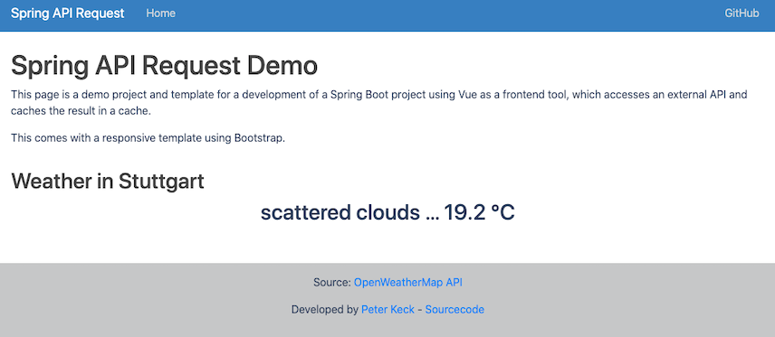

<h1 align="center">Welcome to Spring-api-request 👋</h1>
<p>
  
  <a href="https://github.com/pyrrolizin/flask-api-request/blob/master/LICENSE" target="_blank">
    
  </a>
</p>

>This project is a starting platform for a Spring project with Vue as a frontend tool that pulls data from an external API and caches the result.
>The project includes a responsive Bootstrap template.

## 🏠 [Homepage](https://github.com/pyrrolizin/spring-api-request)

## ✨ Demo (OpenWeatherMap-Api - Current weather in Stuttgart, Germany)

tbd



## Prerequisit

* java 1.17
* maven (or use mvnw)

### Installation

```sh
mvn install
```

### Application properties

You can set the following properties in the file `src/main/resources/application.properties`:

| NAME        |  *required*  |  Comment  |
| ----------- | ------------ | --------- |
| `config.apikey`   | **yes**      |  You can get your own free OpenWeatherApi key on this website: <https://home.openweathermap.org/users/sign_up>   |

Make your own copy of the `application.properties` file and add the keys. 

```sh
cd src/main/resources/
cp ./application.properties_default ./application.properties
```

Learn more about the OpenWeatherMap API: https://openweathermap.org/api

## Getting Started

First, compile and pack the application:

```bash
mvn clean package
```

And run the development server:

```bash
java -jar target/spring-api-request-0.0.1-SNAPSHOT.jar
```

Open [http://localhost:8080](http://localhost:8080) with your browser to see the result.
